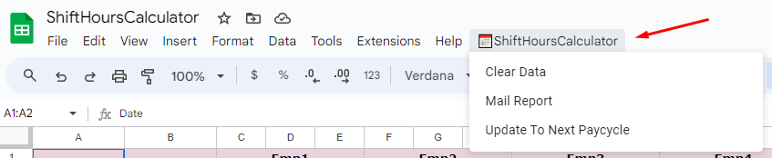

# Shift Hours Calculator

## Overview

The Shift Hours Calculator App Script is a Google Apps Script that allows you to manage and calculate shift hours of the employees bi weekly. This script can be integrated with Google Sheets to streamline the process of tracking and calculating shift hours for small businesses having the staff of 10 or less employees and two week pay cycle.

## Features

- **Employee Shift Hours Track**: Add and manage employee shifts timings in a Google Sheet.
- **Shift Hour Calculation**: Automatically calculate total hours worked by employees based on their shift start and end times.
- **Week Hours Report**: Shows 2 weeks total of shift hours of employees.
- **Mail Report**: Get the employees' total shift hours via Email.
- **Reuse For Next Pay Cycle**: Remove the current data and Update the next pay cycle dates.

## Getting Started

To setup the script, follow these steps:

1. **Create a Google Sheet**:
    - Open the [Shift Hours Calculator Template](https://docs.google.com/spreadsheets/d/11p5GvujiTTLU-EzVuOrWnG7gubT6bdhw4cIMjfTtxA0/edit?usp=sharing) by clicking on the link below.
    ```sh
    https://docs.google.com/spreadsheets/d/11p5GvujiTTLU-EzVuOrWnG7gubT6bdhw4cIMjfTtxA0/edit?usp=sharing
    ```
    - Click on "File" > "Make a Copy" to make a copy from the template.
    - Rename the newly created sheet.
    
2. **Open Script Editor**:
    - Click on "Extensions" in the Google Sheet menu.
    - Select "Apps Script" to open the Google Apps Script editor.

3. **Copy and Paste Code**:
    - Copy the code from the below files in this repository.
        - Main.js
        - ClearAndUpdateData.js
        - EmailReport.js
        - Constants.js
        - Utilities.js
        - EmailTemplate.html
    - Paste the code into the Google Apps Script editor.
    - You can combine all the .js file code to single .gs file or make a seprate .gs file.
    
4. **Save the Script**:
    - Give your project a name.
    - Save the script.

## Usage
1. **Edit Employees Names**: Change the demo names(Emp1, Emp2 etc.) copied from the template to the actual names in the first row of "Time Sheet" tab.
2. **Edit Dates**: Change the dates required in the first column of "Time Sheet" tab.
3. **Add Shift Hours**: Add proper shift timings in the cells of below column in the "Time Sheet" tab.
    - *Shift Start*: Starting time of the shift in 24 hour format(Ex 10:00)
    - *Shift End*: Ending time of the shift in 24 hour format(Ex 17:00).
    - *Duration*: This is auto calculated column. No need to add data.    
4. **ShiftHoursCalculator Menu**: You will find the custom menu named "📅ShiftHoursCalculator" in the menubar having the below three options:

    - `Clear Data`: Clear the entered shift hours data without removing the formulas of cell.
    - `Mail Report`: Get the data of 2 week total hours of the employees with all the data of sheet attached via Email.
    - `Update To Next Pay Cycle`: Get the current data via email and update the sheet ready for next pay cycle.

## Author

- Bhavi Patel ([@bhavi-patel](https://github.com/bhavi-patel))

## Acknowledgments

- This script is built using Google Apps Script and Google Sheets.
- Inspired by the real time problem of managing and calculating labour hours.

Happy Shift Hour Calculating!
